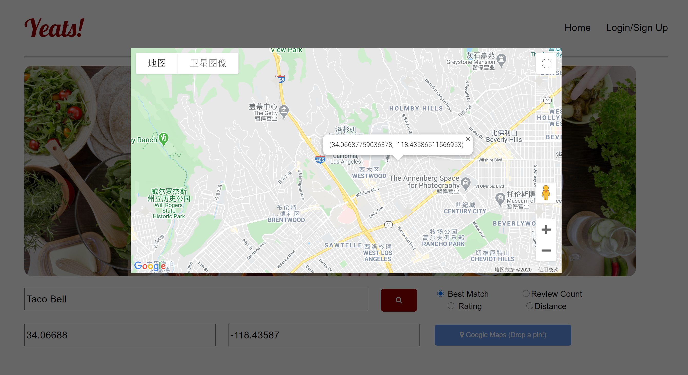
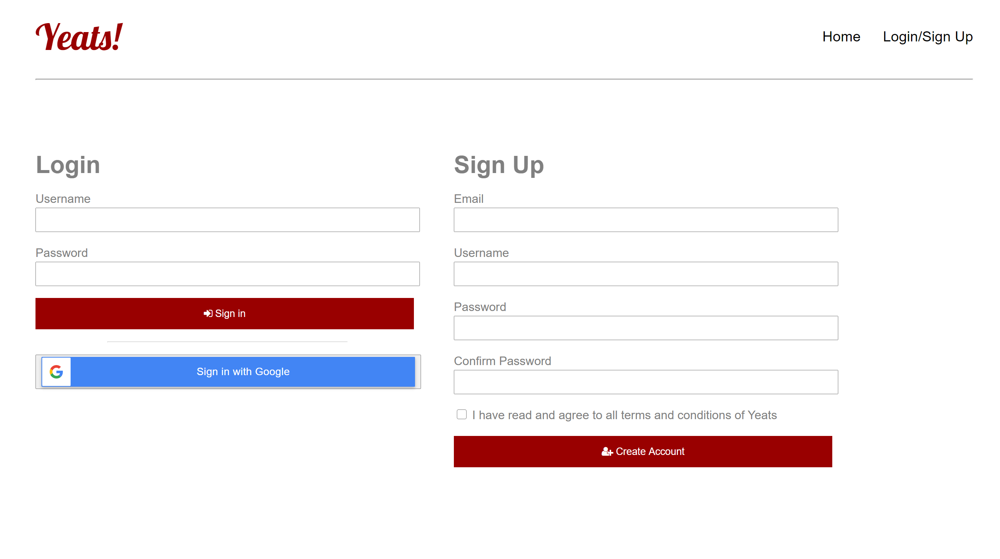
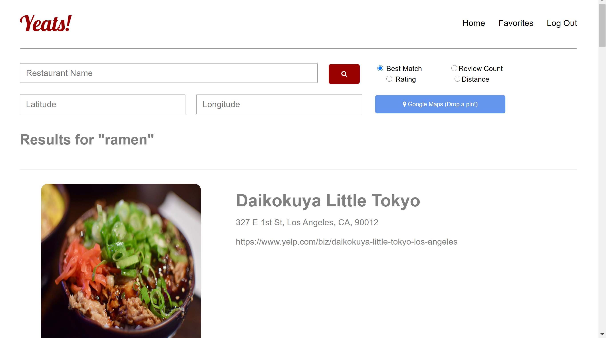
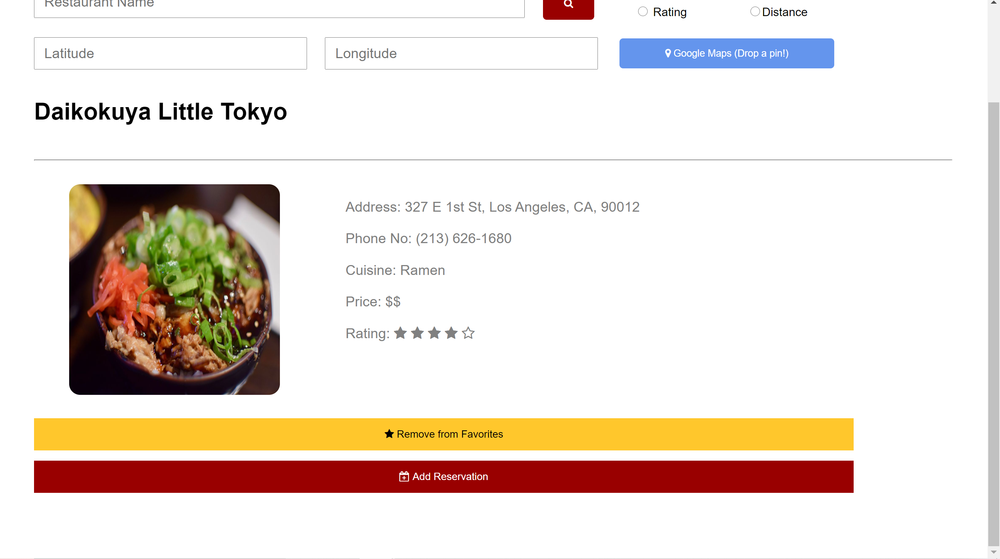
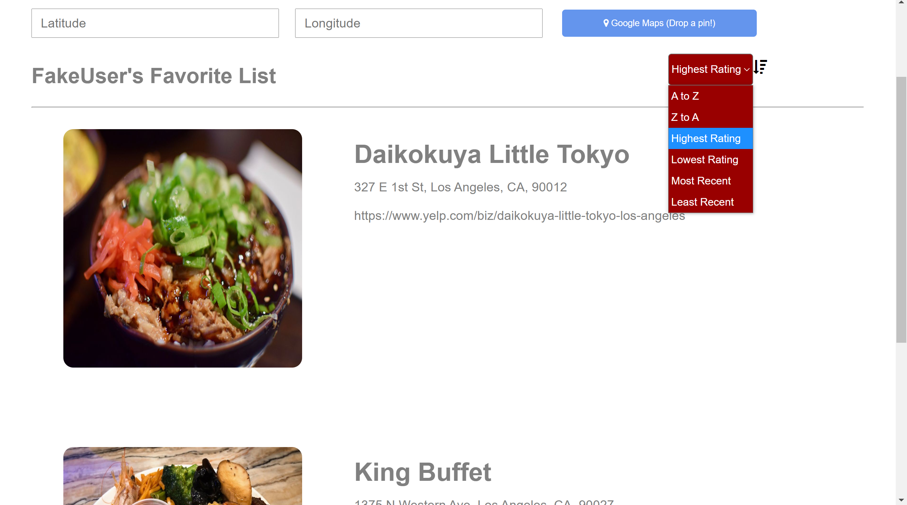

# Yeats

## Search for restaurants near you!

- Many different search options like highest rating or lowest distance
- Inputting locations is made easier with Google Maps
- Create an account to save all your favorite restaurants
- Sign in using a Google account to be able to schedule reservations onto Google Calendar
- Sort through lists in different orders like A to Z or by most recently added

## Screenshots

### HomePage

### Google Maps

### Accounts

### Search Screen

### Restaurant Screen

### Favorites

## Details

- Uses Yelp API to search for restaurants
- Add-ons such as Google Sign in, Google Calendar, Google Maps
- Account management through MySQL Database
- Used Apache Tomcat, JSP, Java Servlets for the backend

#### Disabled Functionalities

- The database is disabled
- Current Yelp API Key is outdated and disabled so create your own API Key here
  - https://www.yelp.com/developers/documentation/v3